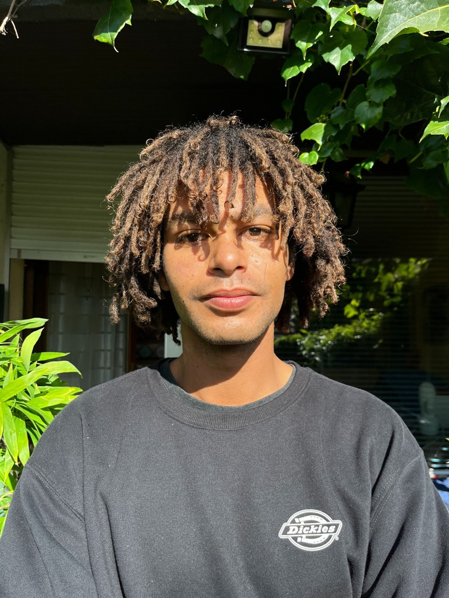

::: {.hero-box}
:::: {.columns}
::: {.column width="65%"}
# Enzo Salvatore

Doctorant en économie à l'Université de Rouen Normandie, membre du **LERN UR 4702**.

Je travaille sur la **gestion intégrée des usages de l'eau**, l'**adaptation au changement climatique** et la **modélisation en équilibre général calculable (MEGC)**, dans une approche **micro–macro**.

::: {.link-row}
[Publications](publications.qmd) · [CV](cv.qmd) · [Enseignement](enseignement.qmd) · [Contact](contact.qmd)
:::
:::

::: {.column width="35%"}
{fig-alt="Portrait d'Enzo Salvatore" .profile-photo}
:::
::::
:::

## Thèmes de recherche

- Économie de l'eau et des ressources
- Adaptation au changement climatique
- Modélisation macroéconomique environnementale
- Modèles d'équilibre général calculable (MEGC)
- Économétrie appliquée aux usages domestiques de l'eau

## Activités

::: {.card-lite}
### Recherche doctorale
Thèse : *Modélisation de la gestion intégrée des usages de l'eau. Une approche micro–macro*.
:::

::: {.card-lite}
### Enseignement
Chargé de TD en microéconomie à l'Université de Rouen Normandie, en L1 et L2 Économie.
:::

::: {.card-lite}
### Vie scientifique
Co-organisation de séminaires doctoraux et du séminaire du LERN, participation au conseil de laboratoire et mentorat étudiant.
:::

## Parcours rapide

- **Depuis 2023** — Doctorat en économie, Université de Rouen Normandie
- **2021–2023** — Master Économie et management publics, Université de Caen Normandie
- **2018–2021** — Licence Économie, Université de Caen Normandie
